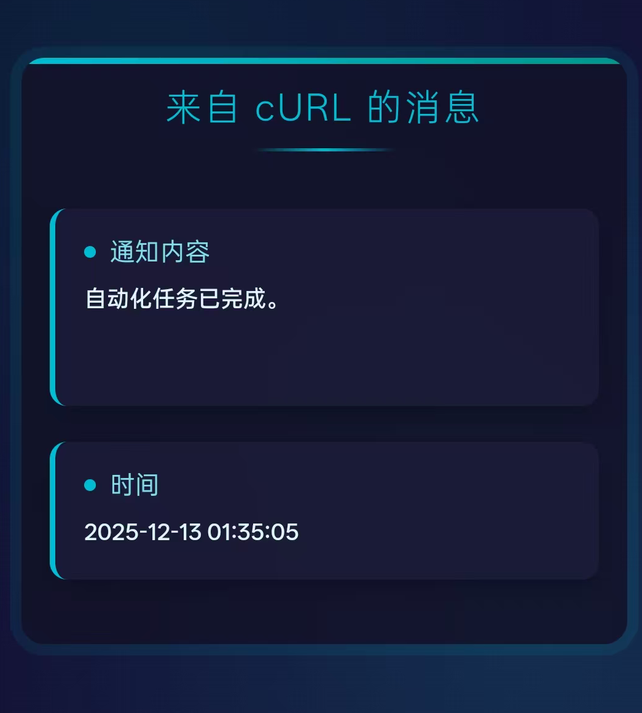

# Go-WXPush - 微信消息推送服务 (基于golang)

这是一个基于 golang 开发的微信测试公众号模板消息推送服务。它提供了一个简单的 API 接口，让您可以轻松地通过 HTTP 请求将消息推送到指定的微信用户。感谢[frankiejun/wxpush](https://github.com/frankiejun/wxpush)

<p align="center">

</p>

## ✨ 特性

✅ 完全免费，下载即使用  
✅ 每天 10 万次额度，个人用不完  
✅ 真正的微信原生弹窗 + 声音提醒  
✅ 支持多用户  
✅ 跳转稳定，自带消息详情页面 (默认使用[https://hzz.cool/detail/](https://hzz.cool/detail/), 可自己部署后使用参数替换)  
✅ 可无限换皮肤 (使用项目[wxpushSkin](https://github.com/frankiejun/wxpushSkin))

## ⚠️ 部署条件

- [微信公众平台接口测试帐号申请](https://mp.weixin.qq.com/debug/cgi-bin/sandbox?t=sandbox/login)

- 获取appid 、appsecret

- 关注测试公众号，获取userid(微信号)，新增测试模板(注意模版内容填写格式 `内容: {{content.DATA}}`)  获取template_id(模板ID)

- 将以上获取到的参数代入下面使用即可

## 🚀 部署指南

### [下载编译好的文件启动](https://github.com/hezhizheng/go-wxpush/releases/)

- 启动参数
    * 命令行启动参数(可不加，启动之后直接在url上拼接参数也可)  `./go-wxpush_windows_amd64.exe -port "5566" -title "测试标题" -content "测试内容" -appid "xxx" -secret "xxx" -userid "xxx-k08" -template_id "xxx-Ks_PwGm--GSzllU" -base_url "https://hzz.cool"`
    *  url请求参数(get)  `与命令行参数名称一致` `/wxsend?appid=xxx&secret=xxx&userid=xxx-k08&template_id=xxx-Ks_PwGm--GSzllU&base_url=https://hzz.cool&content=保持微笑，代码无 bug！`

### 自行编译可执行文件(跨平台)

```
# 用法参考 https://github.com/mitchellh/gox
# 生成文件可直接执行 
gox -osarch="windows/amd64" -ldflags "-s -w" -gcflags="all=-trimpath=${PWD}" -asmflags="all=-trimpath=${PWD}"
gox -osarch="darwin/amd64" -ldflags "-s -w" -gcflags="all=-trimpath=${PWD}" -asmflags="all=-trimpath=${PWD}"
gox -osarch="linux/amd64" -ldflags "-s -w" -gcflags="all=-trimpath=${PWD}" -asmflags="all=-trimpath=${PWD}"
```

## 🗭 默认消息详情页

服务启动成功后会自带消息详情页界面(即消息模板跳转的页面)，访问地址 `http://127.0.0.1:5566/detail` ，如有公网地址，可设置base_url参数为对应的地址即可。


## ⚙️ API 使用方法

服务部署成功后，您可以通过构造 URL 发起 `GET` 请求来推送消息。

### 请求地址

```
http://127.0.0.1:5566/wxsend
```

### 请求参数

| 参数名           | 类型   | 是否必填 | 描述                   |
|---------------|--------|------|----------------------|
| `port`        | String | 否    | 指定启动端口(仅针对命令行)       |
| `title`       | String | 是    | 消息的标题。               |
| `content`     | String | 是    | 消息的具体内容。             |
| `appid`       | String | 否    | 临时覆盖默认的微信 AppID。     |
| `secret`      | String | 否    | 临时覆盖默认的微信 AppSecret。 |
| `userid`      | String | 否    | 临时覆盖默认的接收用户 OpenID。  |
| `template_id` | String | 否    | 临时覆盖默认的模板消息 ID。      |
| `base_url`    | String | 否    | 临时覆盖默认的跳转 URL。       |

### 使用示例

**基础推送**

向默认配置的所有用户推送一条消息：

```
http://127.0.0.1:5566/wxsend?title=服务器通知&content=服务已于北京时间%2022:00%20重启
```

**临时覆盖用户**

向一个临时指定的用户推送消息：

```
http://127.0.0.1:5566/wxsend?title=私人提醒&content=记得带钥匙&userid=temporary_openid_here
```

### Webhook / POST 请求

除了 `GET` 请求，服务也支持 `POST` 方法，更适合用于自动化的 Webhook 集成。

**请求地址**

```
http://127.0.0.1:5566/wxsend
```

**请求方法**

```
POST
```

**请求头 (Headers)**

```json
{
  "Content-Type": "application/json"
}
```

**请求体 (Body)**

请求体需要是一个 JSON 对象，包含与 `GET` 请求相同的参数。

```json
{
  "title": "Webhook 通知",
  "content": "这是一个通过 POST 请求发送的 Webhook 消息。"
}
```

**使用示例 (cURL)**

```bash
curl --location --request POST 'http://127.0.0.1:5566/wxsend' \
--data-raw '{
    "title": "来自 cURL 的消息",
    "content": "自动化任务已完成。"
  }'
```

### 成功响应

如果消息成功发送给至少一个用户，服务会返回 `"errcode": 0` 状态码。

### 失败响应

如果发生错误（如 token 错误、缺少参数、微信接口调用失败等），服务会返回相应的状态码和错误信息。

## 🤝 贡献

欢迎任何形式的贡献！如果您有好的想法或发现了 Bug，请随时提交 Pull Request 或创建 Issue。

## 📜 许可证

本项目采用 [MIT License](./LICENSE.txt) 开源许可证。
